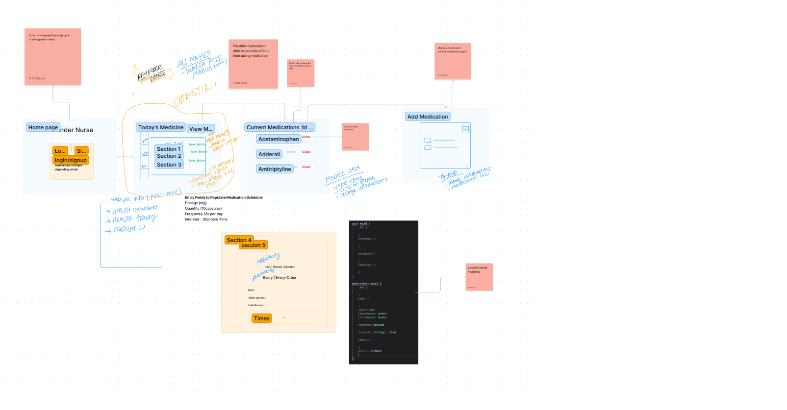

## Reminder Nurse 💊

### This MERN Project is under construction 🔥

     

## Description

70% of Americans regularly take prescription drugs, with more than half with at least two prescriptions. Taking the right drug at the correct time is difficult without a plan and daily reminders. With our cross-platform application Reminder Nurse, we help users stay on track with their dosages through notifications.

### Possible Future Features

We have a lot of development ideas, and we are open to newer ones. Below are some interesting features that could be very useful:

- Information about nearby pharmacies, their locations and timetables

## Technologies Utilized

- [React](https://reactjs.org/)
- [Mongoose](https://mongoosejs.com/docs/guide.html)

- [Chakra UI](https://chakra-ui.com/)
- [MongoDB Atlas](https://www.mongodb.com/cloud/atlas)
- [Heroku](https://www.heroku.com)
- [NPM Apollo Client Package](https://www.npmjs.com/package/stripe)
- [NPM Apollo-Server-Express Package](https://www.npmjs.com/package/apollo-server-express)
- [NPM GraphQL Package](https://www.npmjs.com/package/graphql)
- [NPM Bcrypt Package](https://www.npmjs.com/package/bcrypt)
- [NPM Express.js Package](https://www.npmjs.com/package/express)
- [NPM JSONWebToken](https://www.npmjs.com/package/jsonwebtoken)
- [NPM Mongoose Package](https://www.npmjs.com/package/mongoose)
- [Node.js](https://nodejs.org/en/)
- [NPM nodemon Package](https://www.npmjs.com/package/nodemon)
- [NPM JWT-Decode Package](https://www.npmjs.com/package/jwt-decode)
- [NPM React Package](https://www.npmjs.com/package/react)
- [NPM React-Bootstrap](https://www.npmjs.com/package/react-bootstrap)
- [React-Dom](https://www.npmjs.com/package/react-dom)
- [React-Router-Dom](https://www.npmjs.com/package/react-router-dom)
- [React-Scripts](https://www.npmjs.com/package/react-scripts)

## Installation

First of all you need to get the source code, so clone this repository on your local machine:

From within the root directly of Reminder Nurse:

`npm install`
 
This will install all npm managed dependencies.

## Usage

An email and password is required for sign up and Log in.

### Dashboard - View Medications

Users have a quick access to view their medications with features to add, delete, and edit their medications.

### Add Medications

With a simple form, users can quickly submit medication name, dose, instructions, and set up reminder notifications.

### Modify Medications

From an editable view of their current medication, users can quickly make changes.

### Delete Medication

From current Medications screen, users can quickly delete medications.

## Mockup Images

Images are coming soon ...

## Collaborators

- [Amauri Rodriguez](https://github.com/NicolasFlamel)
- [Manong Chris](https://github.com/christiangella)
- [Alison Paia](https://github.com/AliPaia)
- [Iqbal Ahmadi](https://github.com/IqbalAhmadi)
