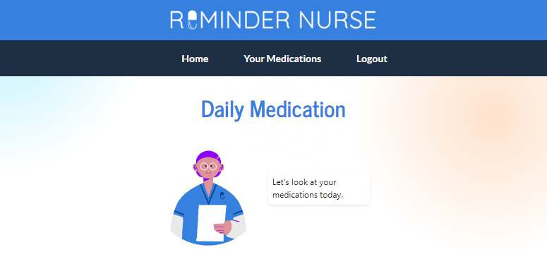

# **Reminder Nurse**

> 70% of Americans regularly take prescription drugs, with more than half with at least two prescriptions. Taking the right drug at the correct time is difficult without a plan and daily reminders.
>
> **Reminder Nurse** is a cross-platform application built using the MERN stack, aimed at helping users stay on track with their medication dosages through notifications.

## **Table Of Contents**

- [**Reminder Nurse**](#reminder-nurse)
  - [**Table Of Contents**](#table-of-contents)
  - [**Features**](#features)
    - [**Front-End**](#front-end)
    - [**Back-End**](#back-end)
  - [**Global Assets**](#global-assets)
  - [**Roadmap**](#roadmap)
  - [**Installation**](#installation)
    - [**HTTPS**:](#https)
    - [**SSH**:](#ssh)
  - [**Usage Instructions**](#usage-instructions)
  - [**Development**](#development)
    - [**Technologies**](#technologies)
    - [**Initial Wireframing**](#initial-wireframing)
  - [**Collaborators**](#collaborators)
  - [**Badges**](#badges)

## **Features**

The deployed application and repository contains the following features:

### **Front-End**

- Contains **semantic structuring** and **React elements** for accessibility and reader compatability. Streamlines processing-time through React Components and **state management** including front-loading data collection and component reuseability.
- Application returns all data pertaining to medication for users to view all scheduled medications, and allows users to add new and edit medications.
- **Media queries** and **CSS** render pages are compatible for multiple device resolutions, including screens, mobile, and desktop to create a responsive and dynamic interface.
- Makes use of **third-party CSS** and **styling frameworks**, including: Bootstrap, FontAwesome, animate.css, and CSS Transitions.
- Allows for desktop notifications during scheduled reminders.

### **Back-End**

- Utilizes **MongoDB** and the **MongooseODM** for the server-side database. Data is structured through schema models for **users** and **medicine** to store defined data-types pertaining to user account information and medication.
- **GraphQL queries and mutations** define how data is created, retrieved, updated, and deleted in the database. These are established through **TypeDefs** and **Resolvers**.
  - Utilizes context to find medicine and adds user's medicine to their queue to create the user's daily medication list.
- **Node.js** establishes the environment for JavaScript to run, and is used in tandem with **Express.js** to manage and launch server routes.
- Protects information and data through user authentication and tokens, and allows pages to be conditionally rendered depending on authentication.

## **Global Assets**

- The repository is structured between client and server-side, with different node packages and package.json files. The package.json file at the root level establishes the script for commands to run both client and server-side concurrently.

## **Roadmap**

The following features are planned for the repository and application:

- **Mobile Notifications**: The application supports desktop notifications, but does not yet currently integrate REACT Native to push mobile notifications.
- **Improved Profile Features**: Currently, there is not an input for users to complete a profile about themselves. A medical card, or a repository where users can store their medical information (i.e. health insurance plan information and medical history) is planned in an expansion of the User model.
- **Local-based Information**: Information about nearby pharmacies, clinics, and hospitals including their locations and timetables are planned for integration into the application to help connect users to local resources.

## **Installation**

In order to create a local copy of the repository, copy the HTTPS or SSH key of the Reminder Nurse repository into your terminal and perform a `git clone`. A copy of this repository can be cloned using either of the following codes:

### **HTTPS**:

> `git clone https://github.com/IqbalAhmadi/Reminder-Nurse.git`

### **SSH**:

> `git clone git@github.com:IqbalAhmadi/Reminder-Nurse.git`

Once you have cloned a copy of the repository, navigate to the repository root and install the necessary third-party packages using `npm install`.

To run locally, you will need to establish a `.env` on the server-side with a `JWT_SECRET` and `JWT_EXP`. Optionally, you can seed the local data-base using `npm run seed`. The application can be deployed locally by running `npm run develop`, which will launch both the client and server files.

To deploy to Heroku, run `heroku login` in the terminal. Run `git init` to initialize the repository. Then, run `git add .` to add the files, and `git commit -m "{message}"` to stage the commit. If you have not created a Heroku application, run `heroku create`. Lastly, push the contents by running `git push heroku {branch}`.

## **Usage Instructions**

On the Reminder Nurse landing screen, the user is prompted to either login or sign up. If not already done, create an account or, if running locally, log into an account in the seed file.

Upon logging in, the user will arrive at the **Home** screen, and will see a list of their daily medications. They will see the medication names, dosage amounts, scheduled time, and remaining dosages.

Depending on the user's screen resolution or device, they can navigate through the application at the top navigation bar (higher resolutions and desktops) or at the bottom navigation bar (lower resolutions and mobile devices).

On the **Your Medications** page, the user can view a list of their active medications and inactive medications. Users can switch their medications on and off by selecting the **trash can** icon on Active Medication, or the **plus icon** on Inactive Medication. The user can also edit their medication's information by selecting the **edit icon**.

By selecting **Add Medication**, users will be prompted to complete a form about their medication, such as the medication's name, dosages, intervals in which the dosages should be administered, amounts, and time in which the dosage is taken.

## **Development**

### **Technologies**

The following technologies comprise the main frameworks for the project:

- [React](https://reactjs.org/)
- [Mongoose](https://mongoosejs.com/docs/guide.html)
- [MongoDB Atlas](https://www.mongodb.com/cloud/atlas)
- [Heroku](https://www.heroku.com)
- [NPM Apollo Client Package](https://www.npmjs.com/package/stripe)
- [NPM Apollo-Server-Express Package](https://www.npmjs.com/package/apollo-server-express)
- [NPM GraphQL Package](https://www.npmjs.com/package/graphql)
- [NPM Bcrypt Package](https://www.npmjs.com/package/bcrypt)
- [NPM Express.js Package](https://www.npmjs.com/package/express)
- [NPM JSONWebToken](https://www.npmjs.com/package/jsonwebtoken)
- [NPM Mongoose Package](https://www.npmjs.com/package/mongoose)
- [Node.js](https://nodejs.org/en/)
- [NPM nodemon Package](https://www.npmjs.com/package/nodemon)
- [NPM JWT-Decode Package](https://www.npmjs.com/package/jwt-decode)
- [NPM React Package](https://www.npmjs.com/package/react)
- [NPM React-Bootstrap](https://www.npmjs.com/package/react-bootstrap)
- [React-Dom](https://www.npmjs.com/package/react-dom)
- [React-Router-Dom](https://www.npmjs.com/package/react-router-dom)
- [React-Scripts](https://www.npmjs.com/package/react-scripts)

### **Initial Wireframing**

The following wireframe outlines the initial vision, user-flow, and deliverables for the repository.

## **Collaborators**

- [Amauri Rodriguez](https://github.com/NicolasFlamel)
- [Manong Chris](https://github.com/christiangella)
- [Alison Paia](https://github.com/AliPaia)
- [Iqbal Ahmadi](https://github.com/IqbalAhmadi)

## **Badges**

     
